# Filter-Artist

In the research of audio signal, we often need to use spectrogram analysis. At the same time, we also need to reduce noise or extract useful frequency components.

In general, in order to reduce noise or extract useful frequency components, we will pass the entire audio signal through a time invariant filter. If the noise is a stationary signal, this method can effectively filter the noise. However, in practice, the noise is often non-stationary, which means that we need to use filters with different parameters at different, that is, use a **time-varying filter**.

The short-time Fourier transform can be used to generate the spectrogram of the audio signal, which contains the frequency component information of the signal changing with time, so we can completely **combine the setting of the time-varying filter with the analysis of the spectrogram**.

Based on [pyAudioKits](https://github.com/HarmoniaLeo/pyAudioKits), **Filter Artist** implements a STFT spectrogram positioning filter analysis system, which aims to perform short-time Fourier transform on audio signals. Moreover, in order to better analyze the spectrogram, we allow users to set **Butterworth filter** at a specific frequency point at a specific time with the help of GUI and mouse, interactively extract the signal components they are interested in, shield the noise, observe the filtered waveform and play the filtered audio in real time.

Environment：

`Python ≥ 3.8.3`

Dependencies：

`pyAudioKits ≥ 1.0.6`

`PyQt5 ≥ 5.15.4`

`numpy ≥ 1.22.4`

`opencv-python ≥ 4.5.2.52`

1. Enter on the command line:：

   ```shell
   python main.py
   ```

   to execute `main.py` and get the window shown as follow.

   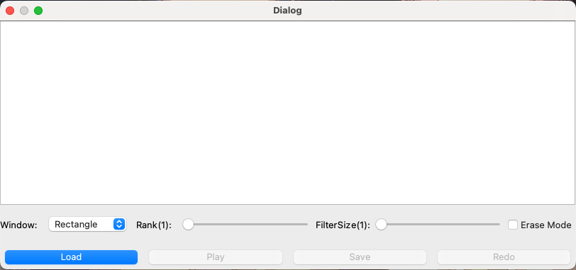

2. Press the load button and read the preset recording file rec2_ 01.wav. 

   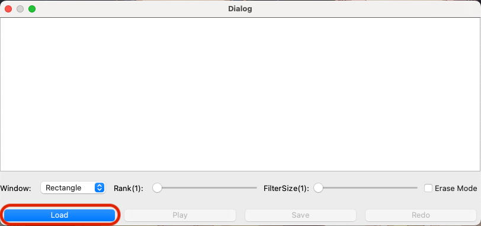

   The spectrogram of rec2_01.wav is shown at this point.

   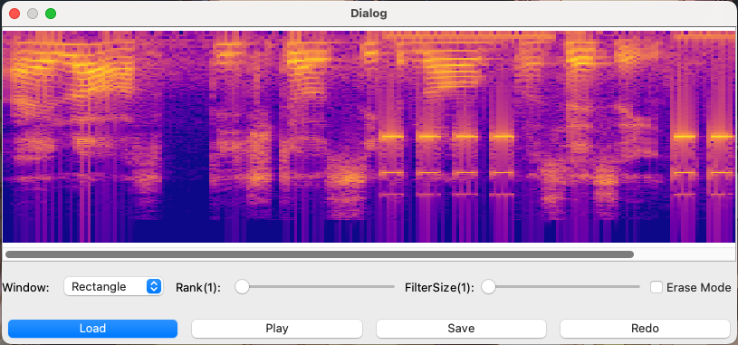

3. A variety of window types can be selected to display the spectrogram. The default display is the result of the rectangular window: 

   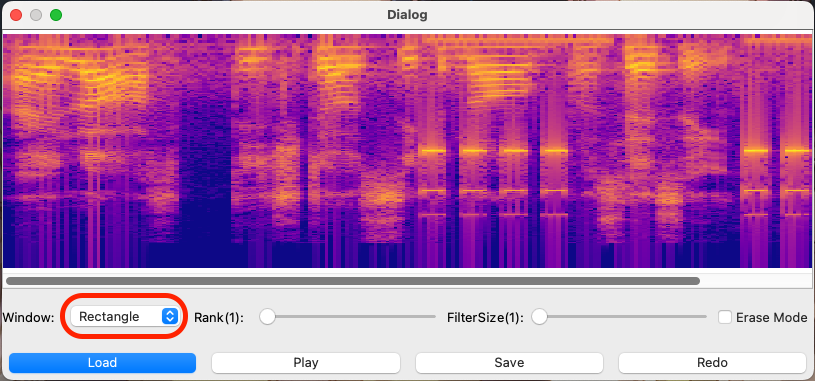

   Using Hamming Windows: 

   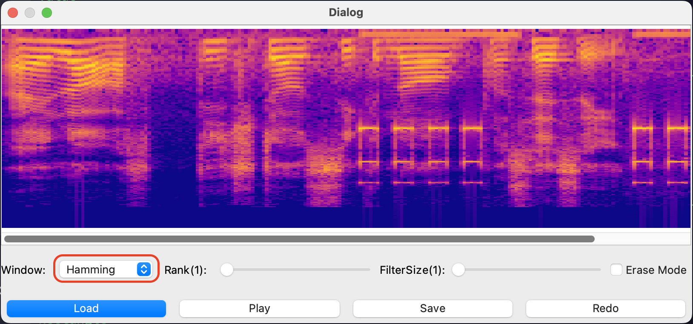

4. The order of the Butterworth filter and the passband/stopband width can be set.

   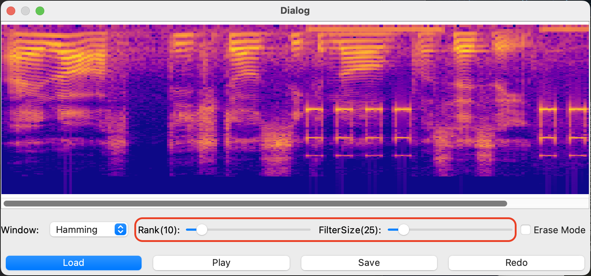

5. If Erase Mode is not checked, the bandpass filter is set. The initial mouse position determines the start time and center frequency of the filter setting, and the mouse release position determines the end time of the filter setting if the mouse is clicked and dragged on the speech spectrum diagram. Set a high frequency passband with larger width to extract the buzzer tone.

   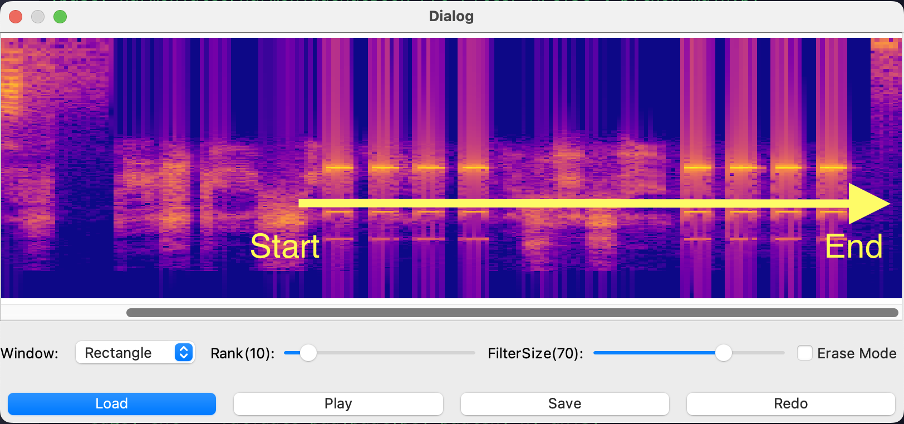

6. If Erase Mode is checked, the filter is set as a bandstop filter. The initial mouse position determines the start time and center frequency of the filter setting, and the mouse release position determines the end time of the filter setting. Set the three stopbands of smaller width to eliminate the buzzer tone.

   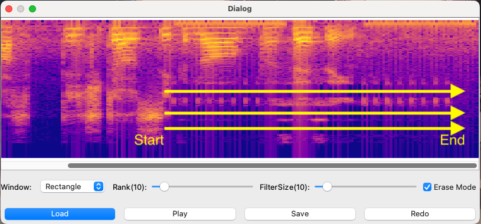

7. Click the play button to play the audio.

   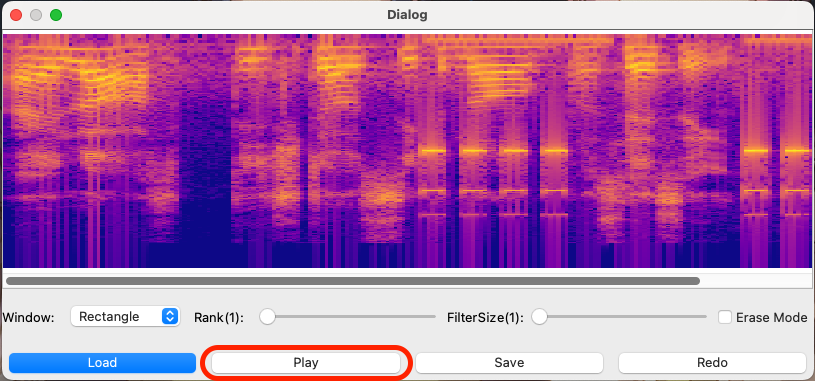

8. Click the Save button to save the audio.

   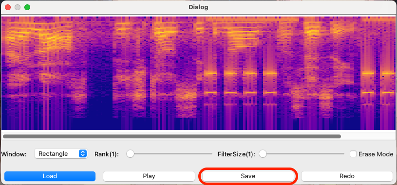

9. Click the Redo button to reset the editing of the audio.

   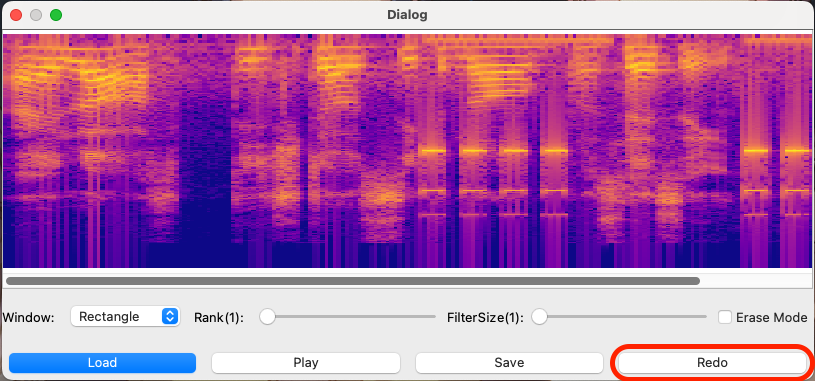
